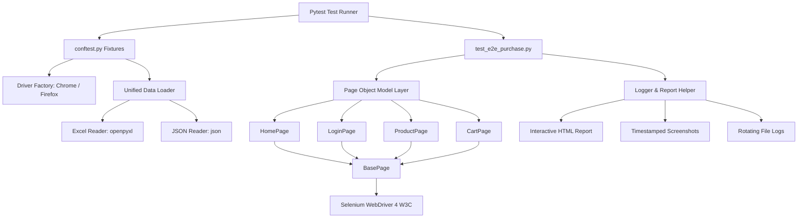

# Architecture & Design Specifications: SeleniumHub Pro

## 1. Architectural Overview & Design Patterns

**SeleniumHub Pro** adheres to modern test automation best practices, emphasizing **modularity**, **maintainability**, **traceability**, and **high resilience**.



### Design Patterns Employed

1. **Page Object Model (POM)**:
   - UI elements (locators) and interactions (methods) are strictly encapsulated within dedicated Page classes (`HomePage`, `LoginPage`, `ProductPage`, `CartPage`).
   - Test files (`test_e2e_purchase.py`) contain **zero raw WebDriver calls or locators**, ensuring high maintainability when UI elements change.

2. **Factory Pattern**:
   - Implemented in `tests/conftest.py` through the `driver` fixture.
   - Decouples browser instantiation, option flags, timeout configuration, and teardown logic from the tests.
   - Resolves drivers automatically using `webdriver-manager`.

3. **Repository Pattern (Data Access Layer)**:
   - `utilities/data_loader.py` acts as a unified repository interface.
   - Abstracted from the underlying storage format, seamlessly loading datasets from either `test_data.xlsx` or `test_data.json` based on configuration.

4. **Fluent Interface / Method Chaining**:
   - Page object methods return `self` or the next logical Page Object (e.g. `home_page.go_to_login() -> LoginPage`, `prod_page.add_to_cart().proceed_to_cart_from_modal() -> CartPage`), enabling clean, readable test scripts.

5. **Dependency Injection**:
   - Pytest fixtures (`driver`, `framework_config`, `test_data`) inject browser instances, configurations, and data rows into tests without global state pollution.

---

## 2. Requirement Traceability Matrix (All 10 Requirements)

| # | Requirement | Implementation Component | Key Methods / Capabilities |
|---|-------------|--------------------------|----------------------------|
| **1** | **Launch Browser** | `tests/conftest.py`<br>`config/config.py` | Configurable Chrome/Firefox via `webdriver-manager`. Window maximized, explicit waits configured, `implicitly_wait(0)`. Zero arbitrary `time.sleep()`. |
| **2** | **Login to Application** | `pages/login_page.py`<br>`pages/home_page.py` | `LoginPage.login_or_register()`. Reads credentials from test dataset. Auto-registration fallback if account is missing. Asserts `"Logged in as <name>"`. |
| **3** | **Search Product** | `pages/product_page.py` | `ProductPage.search_product()`, `verify_search_results_displayed()`. Reads `"Product"` field from data. Verifies catalog matches. Opens detail page. |
| **4** | **Add Product to Cart** | `pages/product_page.py` | `ProductPage.add_to_cart()`. Sets quantity, clicks add to cart. `proceed_to_cart_from_modal()` safely handles cart confirmation modal dialog. |
| **5** | **Update Quantity** | `pages/cart_page.py` | `CartPage.update_quantity()`. Locates quantity input/badge. Clears and enters new quantity from test data. Verifies updated quantity in UI. |
| **6** | **Verify Cart Details** | `pages/cart_page.py` | `CartPage.verify_cart_details()`. Asserts product name matches search query. Asserts quantity equals updated value. Captures unit price and asserts `total = unit_price * quantity`. |
| **7** | **Capture Screenshots** | `pages/base_page.py`<br>`utilities/report_helper.py`<br>`tests/conftest.py` | Step screenshots saved to `screenshots/YYYY-MM-DD_HH-MM-SS/` at: after login, after search, after add to cart, after cart verification. Failure hook automatically captures screenshot on test errors. |
| **8** | **Read Test Data from Excel / JSON** | `utilities/excel_reader.py`<br>`utilities/json_reader.py`<br>`utilities/data_loader.py` | `test_data.xlsx` and `test_data.json` with 3+ complete data rows. Unified loader selects source via `config.DATA_SOURCE`. Tests parameterized per data row. |
| **9** | **Handle Popups / Alerts** | `pages/base_page.py`<br>`pages/product_page.py` | `BasePage.handle_alert()`, `dismiss_common_overlays()`, `dismiss_google_vignette_or_ads()`. Resilient conditional waits with `try/except` so tests never crash when overlays are absent. |
| **10** | **Generate Execution Report** | `pytest.ini`<br>`tests/conftest.py`<br>`utilities/report_helper.py` | Timestamped interactive HTML report (`reports/report_YYYY-MM-DD_HH-MM-SS.html`) via `pytest-html` with embedded failure screenshots, environment metadata, and plain-text execution summary. |

---

## 3. Data & Configuration Architecture

### Data Source Abstraction
```
                  ┌────────────────────────┐
                  │ utilities.data_loader  │
                  └───────────┬────────────┘
                              │
          ┌───────────────────┴───────────────────┐
          ▼                                       ▼
┌───────────────────┐                   ┌───────────────────┐
│ excel_reader.py   │                   │ json_reader.py    │
│ (openpyxl)        │                   │ (json)            │
└─────────┬─────────┘                   └─────────┬─────────┘
          ▼                                       ▼
┌───────────────────┐                   ┌───────────────────┐
│  test_data.xlsx   │                   │  test_data.json   │
└───────────────────┘                   └───────────────────┘
```

The data loader normalizes rows into consistent schema dictionaries:
- `TestID`: Unique test case identifier (e.g. `TC_E2E_01`)
- `FirstName`, `LastName`: User identification for registration/verification
- `Email`, `Password`: User credentials
- `Address`, `City`, `State`, `Zipcode`, `MobileNumber`: Shipping information
- `Product`: Target item name for search and validation
- `InitialQuantity`: Initial quantity added from detail page
- `UpdatedQuantity`: Target quantity modified on the cart page
- `ExpectedUnitPrice`: Benchmark unit price for financial calculation verification

---

## 4. Error Handling and Resilience Strategy

1. **Overlay Interception**:
   - E-commerce demo platforms frequently inject Google AdSense vignettes or cookie consent banners.
   - `BasePage.click()` includes an automatic fallback: if intercepted, it scrolls the element to the center and executes via JavaScript (`js_click`).
   - `BasePage.dismiss_common_overlays()` proactively dismisses Google ad banners and consent modals before interactions.

2. **Dynamic Synchronisation**:
   - `implicitly_wait` is set to `0` to prevent unpredictable cumulative delays.
   - Explicit `WebDriverWait` with polling frequency of `0.5s` and expected conditions (`visibility_of_element_located`, `element_to_be_clickable`) handles all page transitions and AJAX requests.

3. **Safe Teardown**:
   - The `driver` fixture in `conftest.py` is wrapped in `try...finally` ensuring `driver.quit()` is invoked regardless of whether test assertions pass, fail, or encounter unhandled exceptions.
